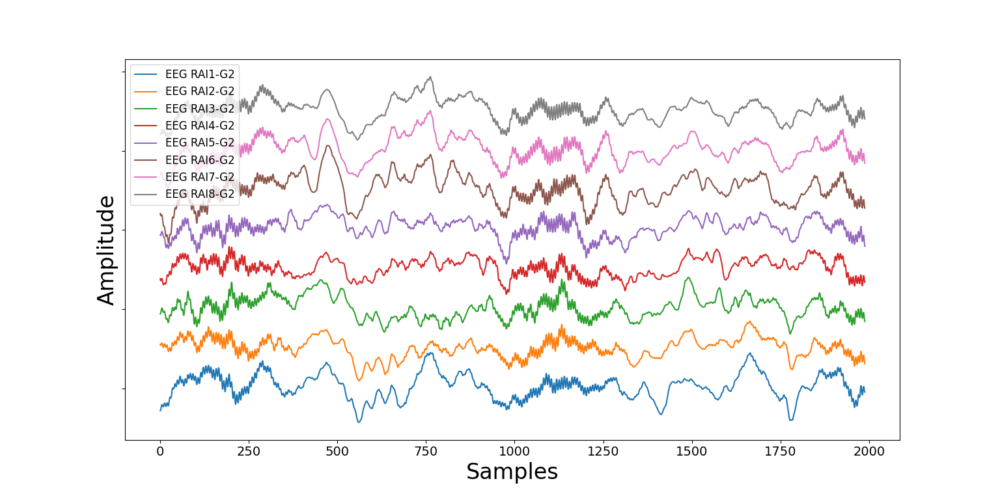
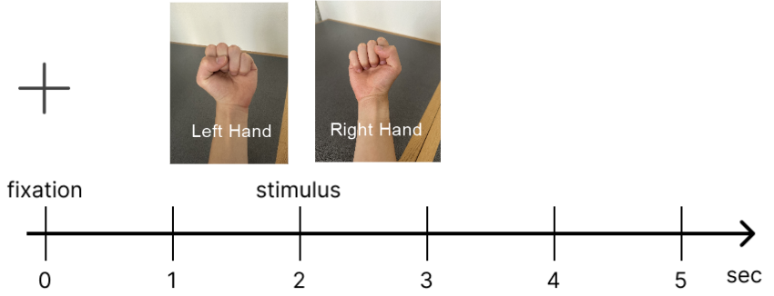
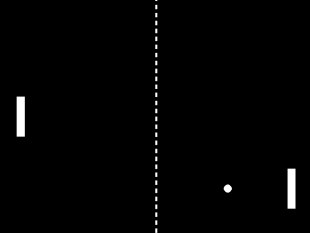

# User Interface Clients

This repository provides examples of user interfaces that take in processed neural data from the NeuroWorks SDK Client using the PublisherZmqProcessor.py class. These user interfaces can be ran in the terminal using the command `python name_of_user_interface.py`. 

## EEG Visualizer

The EEG visualizer is a class that implements a ZeroMQ subscriber to receive data from the `ProcesseData` topic which the NeuroWorks SDK Client (implementing the `PublisherZmqProcessor.py` class) publishes to. Data is plotted via Matplotlib in real-time; the number of channels and window size of plot can be specified at runtime. 

The plotting latency is dependent on the batch sizes that the NeuroWorks SDK Client receives and the number of channels being plotted. The EEG data and a debugging log is saved in real-time `logs/eeg_visualizer`.

## Example Experimental Task: Motor Imagery Task Experiment

A motor imagery task experiment implemented in PsychoPy, that utilizes a ZeroMQ subscriber to receive and save processed EEG data from the `ProcesseData` topic which the NeuroWorks SDK Client (implementing the `PublisherZmqProcessor.py` class) publishes to.

Subject will imagine making a closed fist using the indicated hand, neural data is captured to train a BCI decoder. (Seconds 0-2): Subject presented a fixation screen at beginning of trial to establish a baseline of neural activity. (Seconds 2-5): Image of left or right hand was shown to cue subject to perform imagined movement of that particular hand.

EEG data and its associated experimental stimuli is saved in real-time to `logs/motor_imagery` as the experimental task is occurring. This generated dataset can be used to train a machine learning classifer that decodes motor imagery from EEG data. An example of this can be found in `notebooks/motor_imagery_analysis.ipynb` in the parent directory.

## Example BCI Task: Pong Video Game

A Pong video game implemented in PyGame that utilizes a ZeroMQ subscriber to receive processed EEG data from the `ProcesseData` topic which the NeuroWorks SDK Client (implementing the `PublisherZmqProcessor.py` class) publishes to. Real-time predictions from the motor imagery classification model can be used to control a paddle in the video game. 

The Pong video game utilzies a common spatial pattern (CSP) + linear discriminant analysis (LDA) pipeline for neural decoding. The CSP components and LDA model are learned from the neural data collected during the motor imagery task experiment (see `notebooks/motor_imagery_analysis.ipynb` in the parent directory). The streamed data batch would be projected onto the CSP components and used as features for the machine learning model to make a motor imagery prediction. 

The prediction would serve as a control signal for the paddle’s movement. For example, the subject could control the paddle going up by imagining right hand movement and going down by imaging left hand movement. The trained neural decoder would predict user intention in real-time from the neural measurements.

